# SAP S/4HANA Public Cloud:  Product data MCP Server

# 🎯 Project Goal

Transform your interaction with **SAP S/4HANA Cloud** product data by exposing the OData `API_PRODUCT_SRV` as a dynamic **Model Context Protocol (MCP)** tool. This enables natural language interactions with your product data — no SAP Joule license or setup required :

* *"Show me the top 10 products in the system"* → Automatically queries the Product entity with `$top=10`
* *"Fetch a list of general product details"* → Retrieves live data from the SAP Sandbox
* *"Get me a sample of 50 records"* → Optimized OData retrieval with `$inlinecount`

---

# 🧩 Architecture Overview

Unlike complex JDBC wrappers or multi-hop BTP architectures, this server utilizes a **Python-native FastMCP** approach for direct, lightweight connectivity.

### Core Components:

* **🔌 MCP Protocol Layer:** Built on `mcp.server.fastmcp`, ensuring low-latency communication via `stdio`.
* **🌐 OData Integration:** Direct HTTP `GET` requests to the SAP S/4HANA Cloud Sandbox.

### Approach Benefits:

* **Zero SQL Required:** Interacts directly with SAP's native OData structure.
* **Sandbox Ready:** No complex SAP BTP or Cloud Connector setup required for initial testing.
* **Context Efficient:** Returns structured JSON specifically formatted for LLM consumption.

---

# ✨ Key Features

### 🎨 Natural Language to OData
* **Smart Query Translation:** The AI agent converts natural language intent (e.g., "Show me a few products") into precise function arguments (`top_count`).
* **Safety Limits:** Automatically enforces SAP Sandbox limits (max 50 records) to prevent API throttling.

### 🚀 Production-Ready Logic
* **Error Handling:** Robust `try/catch` blocks around HTTP requests with structured error reporting to the AI.
* **Stdio Protection:** Custom logging configuration directs debug info to `stderr`, keeping `stdout` pure for JSON-RPC protocol integrity.
* **OData V2/V4 Compatibility:** Logic handles both `d/results` (V2) and `value` (V4) JSON response structures.

---

# 🏛️ System Architecture

```mermaid
graph LR
    A[🤖 AI Agent] <-->|Stdio / JSON-RPC| B[🐍 SAP MCP Server]
    B <-->|HTTPS / OData| C[☁️ SAP S/4HANA Sandbox]
    
    subgraph "Local Machine"
    A
    B
    end
    
    subgraph "SAP Ecosystem"
    C
    end
```



## 💡 Use Cases

### 📈 Product Catalog Discovery
**User:** "What kind of products are listed in the system? Show me 5 examples."
* **Tool:** `get_sap_products`
* **Logic:** Fetches a small sample to allow the LLM to infer schema and product types.

### 📊 Data Sampling
**User:** "Download the maximum allowed number of products for analysis."
* **Tool:** `get_sap_products`
* **Logic:** Calls API with `top_count=50` (Sandbox limit).

---

## 🛠️ Installation & Setup

### Prerequisites
* **Python 3.10** or higher
* **pip** or **uv** (recommended)
* Public Sandbox API key
* Claude desktop app

### Setup Guide

1.  **Clone the repository:**
    ```bash
    git clone https://github.com/smrepo/sap-mcp
    cd sap-mcp
    ```

2.  **Install Dependencies:**
    ```bash
    pip install mcp requests
    ```

3.  **Verify the Script:**
    Ensure `sap_mcp_server.py` is in the directory. 

---

## ⚙️ Configuration (Claude Desktop)

To use this server with Claude Desktop, you must add it to your `claude_desktop_config.json` file.

### Windows
**Location:** `%APPDATA%\Claude\claude_desktop_config.json`

```json
{
  "mcpServers": {
    "sap-product-info": {
      "command": "python",
      "args": [
        "C:\\Absolute\\Path\\To\\Your\\Repo\\sap_mcp_server.py"
      ]
    }
  }
}
